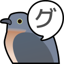

# <sub></sub> Goocoucou

A web extension that helps you navigate Google Search results using shortcuts.

## Get Goocoucou

[](https://addons.mozilla.org/firefox/addon/goocoucou/)<br/>

## Intro Video

](https://youtu.be/Xa_MYxBUB00)

## Developing

To develop run

```sh
# if you use firefox
MANIFEST_VERSION=2 npm run dev
npm run start:firefox

# if you use chromium
MANIFEST_VERSION=3 npm run dev
npm run start:chromium
```

## Build

To build run

```sh
npm run build # parcel build
npm run web-ext:build # this will create .zip file in web-ext-artifacts folder
```

## Translation

Translating on [Translate Web-Ext](https://morikko.github.io/translate-web-extension/configure).

1. Goto [Translate Web-Ext](https://morikko.github.io/translate-web-extension/configure)
2. Paste following line in "Current Source for Translation"

```
https://github.com/FOBshippingpoint/goocoucou-webext/blob/main/src/_locales/en/messages.json
```


3. Switch to Translate tab


4. Start translate

### Languages Available

- en
- zh-TW

## Authors

- [@FOBshippingpoint](https://github.com/FOBshippingpoint)

## License

[MIT](https://choosealicense.com/licenses/mit/)
